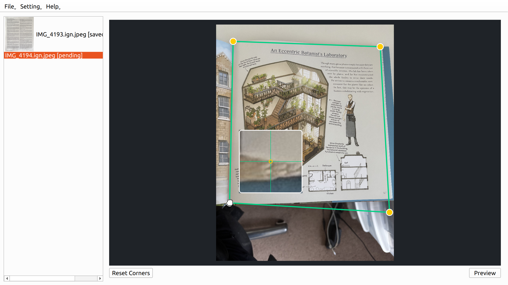
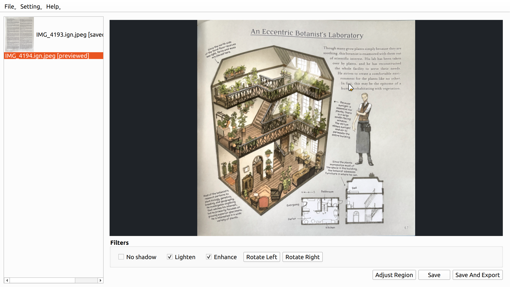
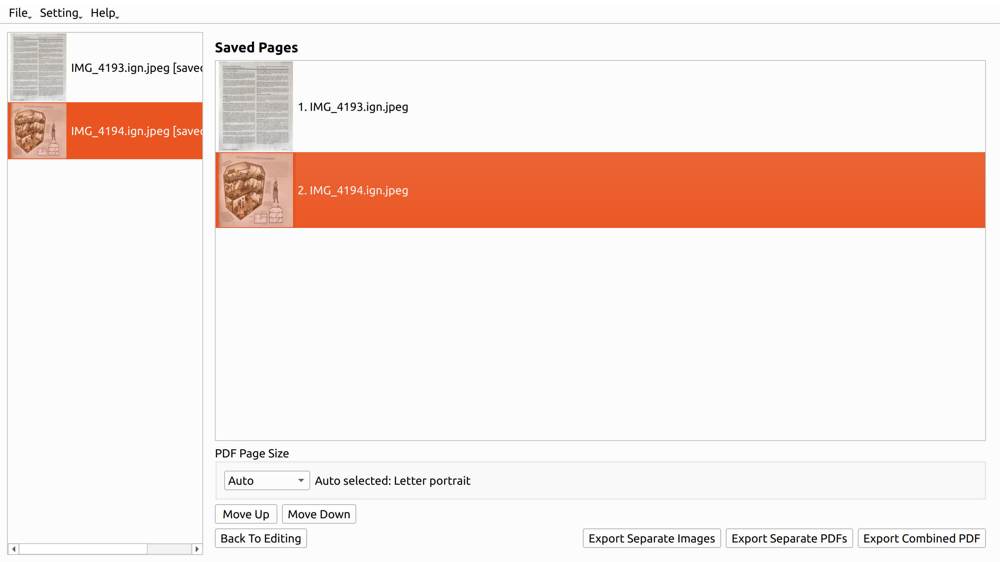

# OSS Cam Scanner

语言：简体中文 | [English](README.en.md)

`OSS Cam Scanner` 是一个仿照全能扫描王的文件扫描工具。用户可以上传多张照片，手动调整文档区域，添加各种滤镜，并将结果导出为扫描效果的图片或 PDF。

## 使用示例

上传多张图片，并调整文档区域



应用滤镜、旋转图片



将多张图片导出为单独图片、PDF 或合并 PDF。



## 安装

```bash
uv sync
```

## 运行

打开 GUI：

```bash
uv run oss-cam-scanner
```

打开 GUI，并预先加入示例图片队列：

```bash
uv run oss-cam-scanner path/to/image1.jpg path/to/image2.png
```

## 本地化

该应用使用 Qt 翻译文件处理 UI 文本。英文源字符串是默认文本。简体中文翻译位于：

```bash
src/oss_cam_scanner/translations/oss_cam_scanner_zh_CN.ts
```

可以使用机器翻译预填充 TS 文件中缺失的条目，在 Qt Linguist 中进行审阅，并将人工编辑保留在 TS 文件中。

使用 Qt Linguist 审阅或编辑 TS 文件，然后将其编译为运行时使用的文件：

```bash
pyside6-lrelease src/oss_cam_scanner/translations/oss_cam_scanner_zh_CN.ts -qm src/oss_cam_scanner/translations/oss_cam_scanner_zh_CN.qm
```

大型翻译文档按区域设置分别存储为 Markdown 文件，位于 `src/oss_cam_scanner/resources/docs/` 下。

## 使用流程

1. 打开一张或多张图片。
2. 通过拖动四个角点调整检测到的文档角点。
3. 点击预览。
4. 调整图片效果：选择滤镜、旋转图片。
5. 保存并前往下一张图片。
6. 在最后一张图片上点击导出，选择导出的方式和顺序，将处理后的文件存储为图片或 PDF。

## 功能

### 图片滤镜

- 不选择任何滤镜时，保持透视校正后的文档不变。
- no shadow：减少不均匀光照和页面阴影，同时保留深色文字和图形。
- lighten：对偏暗照片进行轻微色调提升，使文档变亮。
- enhance：提升局部对比度和清晰度，获得更干净的扫描效果。
- 已选择的滤镜会按固定顺序应用，因此点击顺序不会改变结果。
- Rotate Left 和 Rotate Right 可在预览/滤镜阶段使用，不能在角点调整阶段使用。
- 保存和导出的页面会包含所选滤镜和预览旋转效果。

### 导出

- Save 会在当前会话中将处理后的页面保留在应用内。
- Export Images 会为每个已保存页面写入一个带有 -scan 后缀的 PNG 文件。
- Export PDFs 会为每个已保存页面写入一个带有 -scan 后缀的 PDF 文件。
- Export Combined PDF 会将已保存页面写入一个 PDF。页面初始顺序为上传顺序，导出前可以重新排列。
- PDF 导出支持 Auto、A4、Letter 和 Fit to image 页面尺寸。
- Auto 会根据导出顺序中的第一个已保存页面选择一种页面尺寸和方向，并在 UI 中显示该选择。
